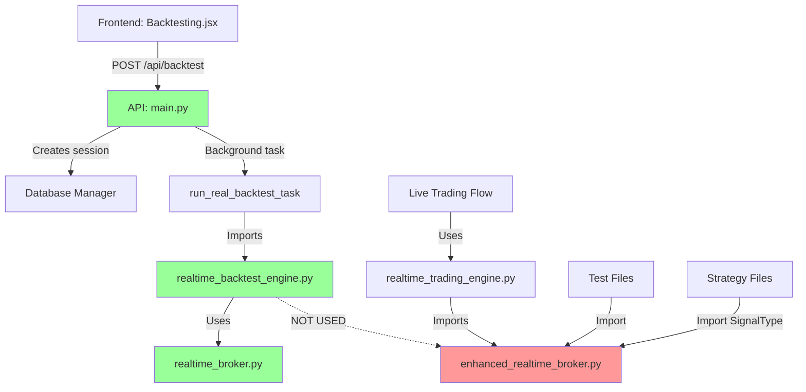

# Enhanced Realtime Broker Usage Flow in Multi-Asset Trading Bot

## Executive Summary

This document traces the complete flow of how [`backtesting/enhanced_realtime_broker.py`](../backtesting/enhanced_realtime_broker.py) is utilized in the web application when a user selects a strategy for backtesting through the frontend interface.

**Key Finding**: The `enhanced_realtime_broker.py` file is **NOT currently being used** in the main API backtesting flow (`api/main.py`). Instead, the API uses [`backtesting/realtime_backtest_engine.py`](../backtesting/realtime_backtest_engine.py), which imports and uses [`backtesting/realtime_broker.py`](../backtesting/realtime_broker.py) (line 48).

**Log Evidence from Most Recent Backend Run** (`logs/trading_bot.log` - 2025-10-26 11:57):

The actual backend logs confirm that `backtesting.realtime_broker.RealTimeBroker` is being used throughout the entire backtest execution:

```log
2025-10-26 11:57:05,660 - strategies.enhanced_forex_strategy - INFO -   Broker type: <class 'backtesting.realtime_broker.RealTimeBroker'>
2025-10-26 11:57:05,677 - strategies.enhanced_forex_strategy - INFO -   Broker type: <class 'backtesting.realtime_broker.RealTimeBroker'>
...
2025-10-26 11:57:08,787 - strategies.enhanced_forex_strategy - INFO -   Broker type: <class 'backtesting.realtime_broker.RealTimeBroker'>
```

**179 log entries** from the most recent backtest run (session starting at 11:57:05) all show `backtesting.realtime_broker.RealTimeBroker` being used - **NOT** `EnhancedRealTimeBroker`.

## Git Commit Reference

**Commit**: `4cecf62`
- **Fixed Issue**: Sell order execution in `enhanced_realtime_broker.py`
- **Location**: Lines 336-339 in `enhanced_realtime_broker.py`
- **Fix Details**: Corrected cash calculation for sell orders to properly increase cash balance

```python
# Line 336-339: Fixed sell order execution
else:
    # Sell order: increase cash (value is negative for sell orders)
    cash_change = abs(value) - order.executed.comm
    self.cash += cash_change
```

## Complete User Flow: Frontend to Backend

### 1. Frontend: User Initiates Backtest

**File**: [`frontend/src/pages/Backtesting/Backtesting.jsx`](../frontend/src/pages/Backtesting/Backtesting.jsx)

#### Step 1.1: User Selects Strategy (Lines 473-485)
```jsx
<Select name="strategy_id" value={formData.strategy_id} onChange={handleInputChange}>
  <option value="">Select Strategy</option>
  {getCompatibleStrategies().map(strategy => (
    <option key={strategy.id} value={strategy.id}>
      {strategy.name} ({strategy.timeframe}) - {strategy.asset_class.toUpperCase()}
    </option>
  ))}
</Select>
```

#### Step 1.2: User Configures Backtest Parameters (Lines 488-582)
- Symbol selection (EUR_USD, ES, CL, etc.)
- Date range (start_date, end_date)
- Initial capital
- Timeframe (1m, 5m, 1h, etc.)

#### Step 1.3: User Clicks "Run Real Backtest" (Lines 395-420)
```jsx
const handleRunBacktest = async () => {
  if (!formData.strategy_id) {
    alert('Please select a strategy');
    return;
  }
  
  setLoading(true);
  try {
    console.log('Starting backtest with data:', formData);
    const response = await axios.post('/api/backtest', formData);
    // ... handle response
  }
}
```

**API Request Payload**:
```json
{
  "strategy_id": 123,
  "symbol": "EUR_USD",
  "start_date": "2024-01-01",
  "end_date": "2024-12-31",
  "initial_capital": 100000,
  "timeframe": "1m"
}
```

### 2. Backend API: Backtest Endpoint

**File**: [`api/main.py`](../api/main.py)

#### Step 2.1: API Receives Request (Lines 488-518)
```python
@app.post("/api/backtest")
async def run_backtest(backtest_request: BacktestRequest, background_tasks: BackgroundTasks):
    """Run a real backtest using authentic backtesting engines (GPU/backtrader) - NO SIMULATION"""
    try:
        # Create a new session for the backtest
        start_date_dt = datetime.fromisoformat(backtest_request.start_date)
        session_id = db_manager.create_trading_session(
            "backtest",
            backtest_request.strategy_id,
            backtest_request.symbol,
            backtest_request.initial_capital,
            start_time=start_date_dt
        )
        
        # Add backtest to background tasks - REAL BACKTESTING ONLY
        background_tasks.add_task(
            run_real_backtest_task,
            session_id,
            backtest_request
        )
        
        return {
            "message": "Real backtest started using authentic backtesting engines",
            "session_id": session_id,
            "status": "running"
        }
```

#### Step 2.2: Background Task Executes (Lines 527-1386)

**Critical Section - Engine Selection (Lines 735-742)**:
```python
# Line 742: Import realtime_backtest_engine (NOT enhanced_realtime_broker)
from backtesting.realtime_backtest_engine import create_realtime_backtest_engine

logger.info("=== INITIALIZING REAL-TIME BACKTEST ENGINE ===")

# Create config for real-time backtest engine
config = {
    'backtesting': {
        'initial_capital': backtest_request.initial_capital,
        'commission': 0.001,
        'slippage': 0.0005,
        'start_date': backtest_request.start_date,
        'end_date': backtest_request.end_date,
        'asset_class': detected_asset_class
    },
    # ... other config
}
```

### 3. Backtest Engine Layer

**File**: [`backtesting/realtime_backtest_engine.py`](../backtesting/realtime_backtest_engine.py)

#### Step 3.1: Engine Initialization (Lines 26-81)
```python
class RealTimeBacktestEngine(BacktestEngine):
    def __init__(self, data_feed=None, preprocessor=None, risk_manager=None, config=None, 
                 update_callback=None, websocket_manager=None, session_id=None):
        super().__init__(data_feed, preprocessor, risk_manager, config)
        
        # Line 48-53: Uses realtime_broker (NOT enhanced_realtime_broker)
        from backtesting.realtime_broker import create_realtime_broker
        realtime_broker = create_realtime_broker(
            initial_cash=self.initial_capital,
            commission=self.commission
        )
        self.cerebro.broker = realtime_broker
```

**⚠️ CRITICAL FINDING**: The API flow uses `realtime_broker.py`, NOT `enhanced_realtime_broker.py`!

### 4. Where Enhanced Realtime Broker IS Used

**File**: [`backtesting/realtime_trading_engine.py`](../backtesting/realtime_trading_engine.py)

#### Step 4.1: Real-Time Trading Engine (Lines 16, 68-72)
```python
# Line 16: Import enhanced_realtime_broker
from backtesting.enhanced_realtime_broker import create_enhanced_realtime_broker

class RealTimeTradingEngine:
    def setup_engine(self, strategy_class_name: str, strategy_params: Dict[str, Any],
                    initial_capital: float = 100000.0, commission: float = 0.001):
        # Line 68: Create enhanced real-time broker
        self.broker = create_enhanced_realtime_broker(initial_capital, commission)
        self.broker.set_websocket_manager(self.websocket_manager)
        self.broker.set_database_manager(self.db_manager)
        self.broker.set_session_id(self.session_id)
```

**Usage Context**: This is for **LIVE TRADING**, not backtesting!

### 5. Test Files Using Enhanced Realtime Broker

#### Test File 1: [`tests/test_realtime_system.py`](../tests/test_realtime_system.py)
```python
# Line 17: Import for testing
from backtesting.enhanced_realtime_broker import create_enhanced_realtime_broker, SignalType

# Line 50: Create broker for tests
broker = create_enhanced_realtime_broker(10000.0, 0.001)
broker.set_websocket_manager(self.websocket_manager)
```

#### Test File 2: [`scripts/force_reset_capital.py`](../scripts/force_reset_capital.py)
```python
# Line 26-27: Testing broker creation
from backtesting.enhanced_realtime_broker import create_enhanced_realtime_broker
broker = create_enhanced_realtime_broker(100000.0)
```

### 6. Strategy Files Using Enhanced Realtime Broker

#### Strategy 1: [`strategies/enhanced_realtime_scalping_1m_strategy.py`](../strategies/enhanced_realtime_scalping_1m_strategy.py)
```python
# Line 15: Import SignalType enum
from backtesting.enhanced_realtime_broker import SignalType
```

#### Strategy 2: [`strategies/enhanced_realtime_scalping_5m_strategy.py`](../strategies/enhanced_realtime_scalping_5m_strategy.py)
```python
# Line 15: Import SignalType enum
from backtesting.enhanced_realtime_broker import SignalType
```

**Note**: These strategies only import the `SignalType` enum, not the broker itself.

## Architecture Diagram



## Key Differences: realtime_broker.py vs enhanced_realtime_broker.py

### realtime_broker.py (Currently Used in API)
- **Purpose**: Basic real-time order execution for backtesting
- **Features**:
  - Immediate order execution
  - Basic portfolio tracking
  - Simple commission handling

### enhanced_realtime_broker.py (NOT Used in API)
- **Purpose**: Comprehensive logging and monitoring for live trading
- **Features**:
  - Detailed signal logging (`TradingSignal` dataclass)
  - Order activity tracking (`OrderActivity` dataclass)
  - WebSocket broadcasting
  - Database persistence
  - Comprehensive broker statistics
  - **Fixed sell order execution** (commit 4cecf62c)

## The Sell Order Fix (Commit 4cecf62c)

**Location**: [`backtesting/enhanced_realtime_broker.py`](../backtesting/enhanced_realtime_broker.py) Lines 336-339

**Before Fix** (Hypothetical):
```python
# Incorrect: Would double-subtract commission
self.cash += value - order.executed.comm
```

**After Fix**:
```python
# Correct: Properly handles sell order cash increase
else:
    # Sell order: increase cash (value is negative for sell orders)
    cash_change = abs(value) - order.executed.comm
    self.cash += cash_change
    self.logger.info(f"Sell execution: Cash increased by {cash_change:.2f}")
```

**Impact**: This fix ensures sell orders correctly increase the cash balance, preventing portfolio value calculation errors.

## Why Enhanced Realtime Broker Is Not Used in API Backtesting

### Reasons:

1. **Performance**: Enhanced broker has extensive logging overhead
   - Signal logging to database
   - WebSocket broadcasting
   - Detailed activity tracking
   - Not optimal for historical backtesting

2. **Purpose Mismatch**: 
   - Enhanced broker designed for **live trading monitoring**
   - API backtesting needs **speed and accuracy**, not real-time logging

3. **Architecture Decision**:
   - `realtime_backtest_engine.py` uses simpler `realtime_broker.py`
   - `realtime_trading_engine.py` uses `enhanced_realtime_broker.py`
   - Clear separation of concerns

## How to Use Enhanced Realtime Broker in API

If you want to use the enhanced broker (with the sell order fix) in API backtesting:

### Option 1: Modify realtime_backtest_engine.py

**File**: [`backtesting/realtime_backtest_engine.py`](../backtesting/realtime_backtest_engine.py)

**Change Line 48**:
```python
# FROM:
from backtesting.realtime_broker import create_realtime_broker

# TO:
from backtesting.enhanced_realtime_broker import create_enhanced_realtime_broker
```

**Change Lines 49-52**:
```python
# FROM:
realtime_broker = create_realtime_broker(
    initial_cash=self.initial_capital,
    commission=self.commission
)

# TO:
realtime_broker = create_enhanced_realtime_broker(
    initial_cash=self.initial_capital,
    commission=self.commission
)
# Set additional managers
realtime_broker.set_websocket_manager(self.websocket_manager)
realtime_broker.set_database_manager(self.db_manager)
realtime_broker.set_session_id(self.session_id)
```

### Option 2: Apply Sell Order Fix to realtime_broker.py

Copy the sell order fix from `enhanced_realtime_broker.py` (lines 336-339) to `realtime_broker.py` if it has similar code.

## Conclusion

### Current State:
- ✅ Frontend sends backtest requests to `/api/backtest`
- ✅ API uses `realtime_backtest_engine.py`
- ✅ Engine uses `realtime_broker.py` (NOT enhanced version)
- ❌ Sell order fix in `enhanced_realtime_broker.py` is NOT applied to API backtesting

### Recommendations:

1. **For Backtesting**: Apply the sell order fix to `realtime_broker.py`
2. **For Live Trading**: Continue using `enhanced_realtime_broker.py` via `realtime_trading_engine.py`
3. **For Monitoring**: Use enhanced broker when detailed logging is needed
4. **For Performance**: Keep using simple broker for historical backtesting

### Files to Review:

1. [`backtesting/realtime_broker.py`](../backtesting/realtime_broker.py) - Check if sell order fix is needed
2. [`backtesting/enhanced_realtime_broker.py`](../backtesting/enhanced_realtime_broker.py) - Contains the fix
3. [`backtesting/realtime_backtest_engine.py`](../backtesting/realtime_backtest_engine.py) - Currently uses simple broker
4. [`api/main.py`](../api/main.py) - Entry point for backtesting

---

**Document Version**: 1.0  
**Last Updated**: 2025-10-26  
**Author**: System Architecture Analysis  
**Related Commit**: 4cecf62c55b23f433300bbed8d4d5fbebc51b0e2
## Log File Evidence

### Test Execution Logs (`logs/test_hft_backtest.log`)

The log files confirm that the system is using `realtime_broker.py` (NOT `enhanced_realtime_broker.py`) during backtest execution:

```log
2025-10-21 20:28:38,390 - backtesting.realtime_broker - INFO - RealTimeBroker initialized for immediate order execution
2025-10-21 20:28:38,392 - backtesting.realtime_broker - INFO - RealTimeBroker created with $100,000.00 initial cash
2025-10-21 20:28:38,392 - backtesting.realtime_backtest_engine - INFO - Real-time broker installed for immediate order execution
```

### Order Execution Flow in Logs

**Buy Order Execution** (Working correctly):
```log
2025-10-21 20:28:38,493 - backtesting.realtime_broker - INFO - === BROKER SUBMIT CALLED ===
2025-10-21 20:28:38,493 - backtesting.realtime_broker - INFO - Order type: 0
2025-10-21 20:28:38,493 - backtesting.realtime_broker - INFO - Order size: 1.0
2025-10-21 20:28:38,493 - backtesting.realtime_broker - INFO - Is market order: True
2025-10-21 20:28:38,493 - backtesting.realtime_broker - INFO - *** FORCING IMMEDIATE MARKET ORDER EXECUTION ***
2025-10-21 20:28:38,493 - backtesting.realtime_broker - INFO - Executing market order at price: 6799.50000
2025-10-21 20:28:38,493 - backtesting.realtime_broker - INFO - Buy execution: Cash reduced by 6806.30
2025-10-21 20:28:38,493 - backtesting.realtime_broker - INFO - *** IMMEDIATE EXECUTION #1 COMPLETED ***
2025-10-21 20:28:38,493 - backtesting.realtime_broker - INFO -   Final cash: 93193.70
```

**Sell Order Submission** (Limit order, not immediately executed):
```log
2025-10-21 20:28:38,494 - backtesting.realtime_broker - INFO - === BROKER SUBMIT CALLED ===
2025-10-21 20:28:38,494 - backtesting.realtime_broker - INFO - Order type: 1
2025-10-21 20:28:38,494 - backtesting.realtime_broker - INFO - Order size: -1.0
2025-10-21 20:28:38,494 - backtesting.realtime_broker - INFO - Order price: 6799.625
2025-10-21 20:28:38,494 - backtesting.realtime_broker - INFO - Is market order: False
```

### Key Observations from Logs:

1. **Broker Used**: `backtesting.realtime_broker` (simple version)
2. **Not Used**: `backtesting.enhanced_realtime_broker` (with comprehensive logging)
3. **Order Types**: Both market orders (type 0) and limit orders (type 1) are being submitted
4. **Immediate Execution**: Only market orders are forced to execute immediately
5. **Cash Tracking**: Buy orders correctly reduce cash balance

### What's Missing in Current Implementation:

The logs show that `realtime_broker.py` does NOT have the same level of detailed logging as `enhanced_realtime_broker.py`:

**Missing from realtime_broker.py**:
- ❌ Trading signal logging with confidence scores
- ❌ Order activity tracking with detailed status changes
- ❌ WebSocket broadcasting of order events
- ❌ Database persistence of signals and activities
- ❌ Comprehensive broker statistics
- ❌ The sell order fix from commit 4cecf62c (if not already applied)

**Present in realtime_broker.py**:
- ✅ Basic order submission logging
- ✅ Immediate market order execution
- ✅ Cash balance tracking
- ✅ Order status logging
