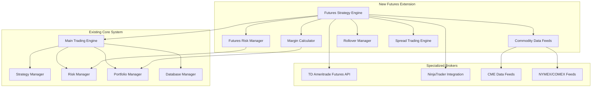

# Comprehensive Futures Trading Integration Plan
## Multi-Asset Trading Bot - Commodity Futures Extension

### Executive Summary

This document outlines a detailed integration plan for extending the existing multi-asset trading bot to support commodity futures trading, with a focus on energy, metals, and agricultural markets. The integration will leverage specialized commodity brokers (TD Ameritrade Futures, NinjaTrader) while maintaining compatibility with the existing OANDA (forex) and CCXT (crypto) infrastructure.

---

## Table of Contents

1. [System Architecture Overview](#system-architecture-overview)
2. [Strategic Framework Design](#strategic-framework-design)
3. [Risk Management Protocols](#risk-management-protocols)
4. [Position Sizing & Leverage Management](#position-sizing--leverage-management)
5. [Margin Management Systems](#margin-management-systems)
6. [Funding Rate & Rollover Optimization](#funding-rate--rollover-optimization)
7. [Stop-Loss & Take-Profit Mechanisms](#stop-loss--take-profit-mechanisms)
8. [Hedging & Spread Trading Strategies](#hedging--spread-trading-strategies)
9. [Market Analysis Integration](#market-analysis-integration)
10. [Backtesting Methodologies](#backtesting-methodologies)
11. [Performance Monitoring Systems](#performance-monitoring-systems)
12. [API Integration Requirements](#api-integration-requirements)
13. [Regulatory Compliance](#regulatory-compliance)
14. [Error Handling & System Resilience](#error-handling--system-resilience)
15. [Scalability & Deployment](#scalability--deployment)
16. [Implementation Timeline](#implementation-timeline)
17. [Resource Requirements](#resource-requirements)
18. [Monitoring & Maintenance](#monitoring--maintenance)

---

## System Architecture Overview

### Current Architecture Analysis

The existing system provides a solid foundation with:
- **Multi-broker support**: OANDA (forex), CCXT (crypto), IBKR (stocks/futures)
- **Real-time data processing**: WebSocket feeds and REST APIs
- **Strategy framework**: Modular strategy system with backtesting
- **Risk management**: Position sizing, drawdown limits, concurrent position controls
- **Database layer**: SQLite with comprehensive trade tracking
- **Frontend dashboard**: React-based monitoring interface

### Futures Integration Architecture



### Key Integration Points

1. **Broker Layer Extension**: Add [`TDAmeritradeFuturesBroker`](execution/broker_connect.py:1) and [`NinjaTraderBroker`](execution/broker_connect.py:1)
2. **Data Feed Enhancement**: Extend [`DataFeed`](data/data_feed.py:22) with commodity-specific feeds
3. **Strategy Framework**: Create [`FuturesStrategyBase`](strategies/futures_strategy.py:13) with commodity-specific logic
4. **Risk Management**: Enhance [`RiskManager`](risk/risk_manager.py:12) with futures-specific calculations
5. **Database Schema**: Extend [`DatabaseManager`](database/database_manager.py:15) with futures tables

---

## Strategic Framework Design

### Commodity Futures Strategy Architecture

#### Base Strategy Framework

```python
class CommodityFuturesStrategy(bt.Strategy):
    """
    Base class for commodity futures trading strategies
    Handles contract specifications, rollover, and commodity-specific logic
    """
    
    params = (
        # Contract Management
        ('contract_month', None),
        ('rollover_days', 5),
        ('auto_rollover', True),
        
        # Risk Parameters
        ('max_position_size', 0.02),  # 2% of portfolio per position
        ('sector_exposure_limit', 0.10),  # 10% max per commodity sector
        ('correlation_limit', 0.7),  # Max correlation between positions
        
        # Commodity-Specific
        ('seasonality_factor', True),
        ('storage_cost_adjustment', True),
        ('weather_sensitivity', False),
        ('supply_demand_analysis', True),
        
        # Technical Parameters
        ('trend_lookback', 20),
        ('volatility_window', 14),
        ('momentum_period', 10),
        ('mean_reversion_threshold', 2.0)
    )
```

#### Commodity-Specific Strategy Types

1. **Energy Futures Strategy**
   - **Crude Oil (CL)**: Inventory-based signals, geopolitical factors
   - **Natural Gas (NG)**: Weather patterns, storage reports
   - **Gasoline (RB)**: Seasonal driving patterns, refinery utilization

2. **Metals Futures Strategy**
   - **Gold (GC)**: Inflation hedge, dollar correlation
   - **Silver (SI)**: Industrial demand, gold ratio analysis
   - **Copper (HG)**: Economic indicator, supply disruptions

3. **Agricultural Futures Strategy**
   - **Corn (ZC)**: Weather patterns, planting/harvest cycles
   - **Soybeans (ZS)**: Export demand, crop reports
   - **Wheat (ZW)**: Global supply, weather conditions

### Strategy Implementation Framework

#### 1. Trend Following Strategy
```python
class CommodityTrendStrategy(CommodityFuturesStrategy):
    """
    Multi-timeframe trend following for commodity futures
    Incorporates seasonality and fundamental factors
    """
    
    def __init__(self):
        super().__init__()
        
        # Technical Indicators
        self.ema_fast = bt.indicators.EMA(period=self.p.fast_ema)
        self.ema_slow = bt.indicators.EMA(period=self.p.slow_ema)
        self.atr = bt.indicators.ATR(period=14)
        self.rsi = bt.indicators.RSI(period=14)
        
        # Commodity-Specific Indicators
        self.seasonality_index = self.calculate_seasonality()
        self.contango_indicator = self.calculate_contango()
        self.inventory_levels = self.get_inventory_data()
        
    def calculate_seasonality(self):
        """Calculate seasonal patterns for the commodity"""
        # Implementation for seasonal analysis
        pass
        
    def calculate_contango(self):
        """Calculate contango/backwardation levels"""
        # Implementation for term structure analysis
        pass
```

#### 2. Mean Reversion Strategy
```python
class CommodityMeanReversionStrategy(CommodityFuturesStrategy):
    """
    Mean reversion strategy for commodity futures
    Focuses on temporary supply/demand imbalances
    """
    
    def __init__(self):
        super().__init__()
        
        # Mean Reversion Indicators
        self.bollinger = bt.indicators.BollingerBands(period=20)
        self.z_score = self.calculate_z_score()
        self.inventory_deviation = self.calculate_inventory_deviation()
        
    def calculate_z_score(self):
        """Calculate price Z-score for mean reversion signals"""
        # Implementation for statistical analysis
        pass
```

#### 3. Spread Trading Strategy
```python
class CommoditySpreadStrategy(CommodityFuturesStrategy):
    """
    Inter-commodity and intra-commodity spread trading
    Calendar spreads, crack spreads, crush spreads
    """
    
    def __init__(self):
        super().__init__()
        
        # Spread Calculations
        self.calendar_spread = self.calculate_calendar_spread()
        self.crack_spread = self.calculate_crack_spread()  # For energy
        self.crush_spread = self.calculate_crush_spread()  # For agriculture
        
    def calculate_calendar_spread(self):
        """Calculate calendar spread between contract months"""
        # Implementation for calendar spread analysis
        pass
```

---

## Risk Management Protocols

### Futures-Specific Risk Framework

#### 1. Enhanced Risk Manager

```python
class FuturesRiskManager(RiskManager):
    """
    Extended risk manager for futures trading
    Handles leverage, margin, and commodity-specific risks
    """
    
    def __init__(self, config):
        super().__init__(config)
        
        # Futures-specific parameters
        self.max_leverage = config.get('max_leverage', 10.0)
        self.margin_buffer = config.get('margin_buffer', 0.25)  # 25% buffer
        self.sector_limits = config.get('sector_limits', {
            'energy': 0.30,
            'metals': 0.25,
            'agriculture': 0.25,
            'other': 0.20
        })
        
        # Correlation matrix for position sizing
        self.correlation_matrix = self.load_correlation_matrix()
        
    def calculate_futures_position_size(self, symbol, current_price, stop_loss_price, 
                                      contract_size, margin_requirement):
        """
        Calculate position size for futures contracts
        Considers leverage, margin, and correlation
        """
        # Base position size calculation
        base_size = super().calculate_position_size(current_price, stop_loss_price, 
                                                   self.current_capital)
        
        # Adjust for contract size and leverage
        contracts = base_size / (contract_size * current_price)
        
        # Apply margin constraints
        required_margin = contracts * margin_requirement
        available_margin = self.current_capital * (1 - self.margin_buffer)
        
        if required_margin > available_margin:
            contracts = available_margin / margin_requirement
            
        # Apply sector limits
        sector = self.get_commodity_sector(symbol)
        sector_exposure = self.calculate_sector_exposure(sector)
        sector_limit = self.sector_limits.get(sector, 0.20)
        
        if sector_exposure + (contracts * contract_size * current_price) > \
           self.current_capital * sector_limit:
            # Reduce position size to stay within sector limits
            max_additional = (self.current_capital * sector_limit) - sector_exposure
            contracts = min(contracts, max_additional / (contract_size * current_price))
        
        return max(0, int(contracts))
    
    def check_correlation_limits(self, new_symbol, position_size):
        """
        Check if new position violates correlation limits
        """
        current_positions = self.get_current_positions()
        
        for existing_symbol, existing_size in current_positions.items():
            correlation = self.correlation_matrix.get((new_symbol, existing_symbol), 0)
            
            if abs(correlation) > self.correlation_limit:
                combined_exposure = (existing_size + position_size) / self.current_capital
                if combined_exposure > self.max_correlated_exposure:
                    return False
                    
        return True
```

#### 2. Dynamic Risk Adjustment

```python
class DynamicRiskAdjuster:
    """
    Dynamically adjusts risk parameters based on market conditions
    """
    
    def __init__(self):
        self.volatility_regimes = {
            'low': {'max_leverage': 15.0, 'position_size_multiplier': 1.2},
            'medium': {'max_leverage': 10.0, 'position_size_multiplier': 1.0},
            'high': {'max_leverage': 5.0, 'position_size_multiplier': 0.7},
            'extreme': {'max_leverage': 2.0, 'position_size_multiplier': 0.4}
        }
        
    def adjust_risk_parameters(self, current_volatility, historical_volatility):
        """
        Adjust risk parameters based on volatility regime
        """
        volatility_ratio = current_volatility / historical_volatility
        
        if volatility_ratio < 0.7:
            regime = 'low'
        elif volatility_ratio < 1.3:
            regime = 'medium'
        elif volatility_ratio < 2.0:
            regime = 'high'
        else:
            regime = 'extreme'
            
        return self.volatility_regimes[regime]
```

---

## Position Sizing & Leverage Management

### Advanced Position Sizing Framework

#### 1. Kelly Criterion for Futures

```python
class FuturesKellyCriterion:
    """
    Kelly Criterion implementation for futures trading
    Accounts for leverage and margin requirements
    """
    
    def __init__(self, lookback_period=252):
        self.lookback_period = lookback_period
        self.trade_history = []
        
    def calculate_kelly_fraction(self, win_rate, avg_win, avg_loss, leverage=1.0):
        """
        Calculate optimal position size using Kelly Criterion
        Modified for futures leverage
        """
        if avg_loss == 0:
            return 0.0
            
        # Basic Kelly formula: f = (bp - q) / b
        # where b = avg_win/avg_loss, p = win_rate, q = 1 - win_rate
        b = avg_win / avg_loss
        p = win_rate
        q = 1 - win_rate
        
        kelly_fraction = (b * p - q) / b
        
        # Adjust for leverage
        leveraged_kelly = kelly_fraction / leverage
        
        # Apply fractional Kelly (typically 25-50% of full Kelly)
        conservative_kelly = leveraged_kelly * 0.25
        
        return max(0, min(conservative_kelly, 0.10))  # Cap at 10%
    
    def update_trade_history(self, trade_result):
        """Update trade history for Kelly calculation"""
        self.trade_history.append(trade_result)
        
        # Keep only recent trades
        if len(self.trade_history) > self.lookback_period:
            self.trade_history = self.trade_history[-self.lookback_period:]
```

#### 2. Volatility-Adjusted Position Sizing

```python
class VolatilityAdjustedSizing:
    """
    Position sizing based on volatility targeting
    """
    
    def __init__(self, target_volatility=0.15):
        self.target_volatility = target_volatility
        
    def calculate_position_size(self, symbol, current_volatility, portfolio_value):
        """
        Calculate position size to achieve target portfolio volatility
        """
        # Volatility scaling factor
        vol_scalar = self.target_volatility / current_volatility
        
        # Base position size (e.g., 2% of portfolio)
        base_position = portfolio_value * 0.02
        
        # Adjust for volatility
        adjusted_position = base_position * vol_scalar
        
        # Apply reasonable bounds
        min_position = portfolio_value * 0.005  # 0.5% minimum
        max_position = portfolio_value * 0.05   # 5% maximum
        
        return max(min_position, min(adjusted_position, max_position))
```

### Leverage Management System

#### 1. Dynamic Leverage Calculator

```python
class DynamicLeverageManager:
    """
    Manages leverage based on market conditions and portfolio performance
    """
    
    def __init__(self, base_leverage=5.0, max_leverage=20.0):
        self.base_leverage = base_leverage
        self.max_leverage = max_leverage
        self.performance_history = []
        
    def calculate_optimal_leverage(self, current_drawdown, volatility_regime, 
                                 recent_performance):
        """
        Calculate optimal leverage based on multiple factors
        """
        # Start with base leverage
        leverage = self.base_leverage
        
        # Adjust for drawdown
        if current_drawdown > 0.05:  # 5% drawdown
            leverage *= (1 - current_drawdown * 2)  # Reduce leverage
            
        # Adjust for volatility
        if volatility_regime == 'high':
            leverage *= 0.7
        elif volatility_regime == 'extreme':
            leverage *= 0.4
        elif volatility_regime == 'low':
            leverage *= 1.3
            
        # Adjust for recent performance
        if recent_performance < -0.02:  # Recent losses
            leverage *= 0.8
        elif recent_performance > 0.02:  # Recent gains
            leverage *= 1.1
            
        return max(1.0, min(leverage, self.max_leverage))
```

---

## Margin Management Systems

### Cross-Margin vs Isolated Margin Implementation

#### 1. Margin Calculator

```python
class FuturesMarginCalculator:
    """
    Calculates margin requirements for futures positions
    Supports both cross-margin and isolated margin modes
    """
    
    def __init__(self):
        self.margin_requirements = self.load_margin_requirements()
        self.portfolio_margin_enabled = False
        
    def load_margin_requirements(self):
        """Load current margin requirements for all contracts"""
        return {
            # Energy
            'CL': {'initial': 4400, 'maintenance': 4000},  # Crude Oil
            'NG': {'initial': 1650, 'maintenance': 1500},  # Natural Gas
            'RB': {'initial': 4620, 'maintenance': 4200},  # Gasoline
            
            # Metals
            'GC': {'initial': 4400, 'maintenance': 4000},  # Gold
            'SI': {'initial': 6600, 'maintenance': 6000},  # Silver
            'HG': {'initial': 3300, 'maintenance': 3000},  # Copper
            
            # Agriculture
            'ZC': {'initial': 1650, 'maintenance': 1500},  # Corn
            'ZS': {'initial': 4950, 'maintenance': 4500},  # Soybeans
            'ZW': {'initial': 2970, 'maintenance': 2700},  # Wheat
        }
    
    def calculate_initial_margin(self, symbol, contracts, margin_mode='cross'):
        """Calculate initial margin requirement"""
        if symbol not in self.margin_requirements:
            raise ValueError(f"Unknown symbol: {symbol}")
            
        base_margin = self.margin_requirements[symbol]['initial']
        total_margin = base_margin * contracts
        
        if margin_mode == 'cross' and self.portfolio_margin_enabled:
            # Apply portfolio margin offsets
            total_margin *= self.calculate_portfolio_margin_offset(symbol)
            
        return total_margin
    
    def calculate_maintenance_margin(self, symbol, contracts):
        """Calculate maintenance margin requirement"""
        base_margin = self.margin_requirements[symbol]['maintenance']
        return base_margin * contracts
    
    def calculate_portfolio_margin_offset(self, symbol):
        """Calculate portfolio margin offset for correlated positions"""
        # Simplified portfolio margin calculation
        # In practice, this would be much more complex
        current_positions = self.get_current_positions()
        
        offset_factor = 1.0
        for pos_symbol, pos_contracts in current_positions.items():
            if pos_symbol != symbol:
                correlation = self.get_correlation(symbol, pos_symbol)
                if correlation < -0.5:  # Negatively correlated
                    offset_factor *= 0.85  # 15% margin reduction
                elif correlation > 0.7:  # Highly correlated
                    offset_factor *= 1.1   # 10% margin increase
                    
        return max(0.5, min(offset_factor, 1.5))  # Bound between 50% and 150%
```

#### 2. Margin Monitoring System

```python
class MarginMonitor:
    """
    Real-time margin monitoring and alert system
    """
    
    def __init__(self, broker_connector, alert_thresholds=None):
        self.broker = broker_connector
        self.alert_thresholds = alert_thresholds or {
            'margin_call': 1.1,      # 110% of maintenance margin
            'warning': 1.25,         # 125% of maintenance margin
            'comfortable': 1.5       # 150% of maintenance margin
        }
        
    def check_margin_status(self):
        """Check current margin status across all positions"""
        account_info = self.broker.get_account_info()
        positions = self.broker.get_positions()
        
        total_maintenance_margin = 0
        available_funds = account_info['available_funds']
        
        margin_status = {
            'status': 'healthy',
            'margin_ratio': 0,
            'positions_at_risk': [],
            'recommended_actions': []
        }
        
        for position in positions:
            maintenance_margin = self.calculate_maintenance_margin(
                position['symbol'], position['contracts']
            )
            total_maintenance_margin += maintenance_margin
            
            # Check individual position margin
            position_equity = position['unrealized_pnl'] + position['initial_margin']
            position_margin_ratio = position_equity / maintenance_margin
            
            if position_margin_ratio < self.alert_thresholds['margin_call']:
                margin_status['positions_at_risk'].append({
                    'symbol': position['symbol'],
                    'margin_ratio': position_margin_ratio,
                    'risk_level': 'critical'
                })
                
        # Calculate overall margin ratio
        if total_maintenance_margin > 0:
            margin_status['margin_ratio'] = available_funds / total_maintenance_margin
            
            if margin_status['margin_ratio'] < self.alert_thresholds['margin_call']:
                margin_status['status'] = 'margin_call'
                margin_status['recommended_actions'].append('Close positions or add funds')
            elif margin_status['margin_ratio'] < self.alert_thresholds['warning']:
                margin_status['status'] = 'warning'
                margin_status['recommended_actions'].append('Monitor closely, consider reducing positions')
                
        return margin_status
```

---

## Funding Rate & Rollover Optimization

### Contract Rollover Management

#### 1. Rollover Strategy Engine

```python
class ContractRolloverManager:
    """
    Manages contract rollovers for futures positions
    Optimizes timing based on volume, spread, and market conditions
    """
    
    def __init__(self):
        self.rollover_rules = self.load_rollover_rules()
        self.volume_threshold = 0.7  # Roll when front month volume drops below 70%
        
    def load_rollover_rules(self):
        """Load rollover rules for different commodity sectors"""
        return {
            'energy': {
                'default_days': 5,
                'volume_based': True,
                'spread_threshold': 0.02  # 2% spread threshold
            },
            'metals': {
                'default_days': 3,
                'volume_based': True,
                'spread_threshold': 0.015
            },
            'agriculture': {
                'default_days': 7,
                'volume_based': True,
                'spread_threshold': 0.025,
                'seasonal_adjustment': True
            }
        }
    
    def should_rollover(self, symbol, current_contract, next_contract):
        """
        Determine if position should be rolled to next contract
        """
        sector = self.get_commodity_sector(symbol)
        rules = self.rollover_rules.get(sector, self.rollover_rules['energy'])
        
        # Check days to expiration
        days_to_expiry = self.get_days_to_expiry(current_contract)
        if days_to_expiry <= rules['default_days']:
            return True, 'expiration_approaching'
            
        # Check volume ratio
        if rules['volume_based']:
            current_volume = self.get_contract_volume(current_contract)
            next_volume = self.get_contract_volume(next_contract)
            
            if next_volume > 0:
                volume_ratio = current_volume / (current_volume + next_volume)
                if volume_ratio < self.volume_threshold:
                    return True, 'volume_shift'
                    
        # Check spread cost
        spread_cost = self.calculate_rollover_spread(current_contract, next_contract)
        if spread_cost > rules['spread_threshold']:
            return False, 'spread_too_wide'
            
        return False, 'no_rollover_needed'
    
    def execute_rollover(self, symbol, current_position, target_contract):
        """
        Execute rollover from current to target contract
        """
        rollover_plan = {
            'symbol': symbol,
            'current_contract': current_position['contract'],
            'target_contract': target_contract,
            'position_size': current_position['size'],
            'execution_method': 'spread_order',  # or 'leg_by_leg'
            'max_spread_cost': 0.02
        }
        
        # Execute spread order if possible
        if self.broker.supports_spread_orders():
            spread_order = self.create_spread_order(rollover_plan)
            return self.broker.place_spread_order(spread_order)
        else:
            # Execute leg-by-leg
            return self.execute_leg_by_leg_rollover(rollover_plan)
```

#### 2. Contango/Backwardation Analysis

```python
class TermStructureAnalyzer:
    """
    Analyzes futures term structure for trading opportunities
    """
    
    def __init__(self):
        self.term_structure_data = {}
        
    def calculate_contango_backwardation(self, symbol):
        """
        Calculate contango/backwardation levels across the curve
        """
        contracts = self.get_contract_chain(symbol)
        if len(contracts) < 2:
            return None
            
        term_structure = []
        for i in range(len(contracts) - 1):
            front_price = contracts[i]['price']
            back_price = contracts[i + 1]['price']
            
            # Calculate annualized roll yield
            days_between = (contracts[i + 1]['expiry'] - contracts[i]['expiry']).days
            roll_yield = ((back_price / front_price) - 1) * (365 / days_between)
            
            term_structure.append({
                'front_contract': contracts[i]['symbol'],
                'back_contract': contracts[i + 1]['symbol'],
                'roll_yield': roll_yield,
                'spread': back_price - front_price,
                'spread_pct': (back_price - front_price) / front_price
            })
            
        return term_structure
    
    def identify_calendar_spread_opportunities(self, symbol, min_yield=0.05):
        """
        Identify calendar spread trading opportunities
        """
        term_structure = self.calculate_contango_backwardation(symbol)
        if not term_structure:
            return []
            
        opportunities = []
        for spread in term_structure:
            if abs(spread['roll_yield']) > min_yield:
                opportunity = {
                    'type': 'contango' if spread['roll_yield'] > 0 else 'backwardation',
                    'front_contract': spread['front_contract'],
                    'back_contract': spread['back_contract'],
                    'expected_yield': spread['roll_yield'],
                    'recommended_action': 'sell_front_buy_back' if spread['roll_yield'] > 0 else 'buy_front_sell_back'
                }
                opportunities.append(opportunity)
                
        return opportunities
```

---

## Stop-Loss & Take-Profit Mechanisms

### Advanced Order Management

#### 1. Dynamic Stop-Loss System

```python
class DynamicStopLossManager:
    """
    Advanced stop-loss management for futures positions
    Includes trailing stops, volatility-based stops, and time-based exits
    """
    
    def __init__(self):
        self.stop_types = {
            'fixed': self.calculate_fixed_stop,
            'atr': self.calculate_atr_stop,
            'volatility': self.calculate_volatility_stop,
            'trailing': self.calculate_trailing_stop,
            'time': self.calculate_time_stop
        }
        
    def calculate_atr_stop(self, symbol, entry_price, direction, atr_multiplier=2.0):
        """
        Calculate ATR-based stop loss
        """
        current_atr = self.get_atr(symbol, period=14)
        
        if direction == 'long':
            stop_price = entry_price - (current_atr * atr_multiplier)
        else:
            stop_price = entry_price + (current_atr * atr_multiplier)
            
        return stop_price
    
    def calculate_volatility_stop(self, symbol, entry_price, direction, vol_multiplier=2.5):
        """
        Calculate volatility-based stop loss using standard deviation
        """
        price_data = self.get_price_data(symbol, lookback=20)
        volatility = price_data.std()
        
        if direction == 'long':
            stop_price = entry_price - (volatility * vol_multiplier)
        else:
            stop_price = entry_price + (volatility * vol_multiplier)
            
        return stop_price
    
    def update_trailing_stop(self, position, current_price):
        """
        Update trailing stop based on favorable price movement
        """
        if position['direction'] == 'long':
            # For long positions, only move stop up
            if current_price > position['highest_price']:
                position['highest_price'] = current_price
                new_stop = current_price - position['trailing_distance']
                
                if new_stop > position['stop_price']:
                    position['stop_price'] = new_stop
                    return True
        else:
            # For short positions, only move stop down
            if current_price < position['lowest_price']:
                position['lowest_price'] = current_price
                new_stop = current_price + position['trailing_distance']
                
                if new_stop < position['stop_price']:
                    position['stop_price'] = new_stop
                    return True
                    
        return False
```

#### 2. Intelligent Take-Profit System

```python
class IntelligentTakeProfitManager:
    """
    Advanced take-profit management with multiple exit strategies
    """
    
    def __init__(self):
        self.exit_strategies = {
            'fixed_ratio': self.calculate_fixed_ratio_tp,
            'fibonacci': self.calculate_fibonacci_tp,
            'support_resistance': self.calculate_sr_tp,
            'volatility_target': self.calculate_volatility_tp,
            'partial_profits': self.calculate_partial_tp
        }
        
    def calculate_fibonacci_tp(self, entry_price, stop_price, direction):
        """
        Calculate take-profit levels based on Fibonacci ratios
        """
        risk = abs(entry_price - stop_price)
        
        fib_levels = [1.618, 2.618, 4.236]  # Common Fibonacci extensions
        tp_levels = []
        
        for fib in fib_levels:
            if direction == 'long':
                tp_price = entry_price + (risk * fib)
            else:
                tp_price = entry_price - (risk * fib)
                
            tp_levels.append({
                'level': fib,
                'price': tp_price,
                'risk_reward': fib
            })
            
        return tp_levels
    
    def calculate_partial_tp(self, position, current_price):
        """
        Calculate partial take-profit levels for scaling out
        """
        unrealized_pnl = self.calculate_unrealized_pnl(position, current_price)
        initial_risk = position['initial_risk']
        
        partial_levels = []
        
        # Take 25% profit at 1:1 risk/reward
        if unrealized_pnl >= initial_risk:
            partial_levels.append({
                'percentage': 0.25,
                'trigger_price': current_price,
                'reason': '1:1_risk_reward'
            })
            
        # Take 50% profit at 2:1 risk/reward
        if unrealized_pnl >= initial_risk * 2:
            partial_levels.append({
                'percentage': 0.50,
                'trigger_price': current_price,
                'reason': '2:1_risk_reward'
            })
            
        return partial_levels
```

---

## Hedging & Spread Trading Strategies

### Multi-Asset Hedging Framework

#### 1. Portfolio Hedging System

```python
class PortfolioHedgingManager:
    """
    Manages portfolio-level hedging across multiple asset classes
    """
    
    def __init__(self):
        self.hedge_instruments = {
            'equity_hedge': ['ES', 'NQ', 'YM'],  # Index futures
            'commodity_hedge': ['DX'],           # Dollar index
            'inflation_hedge': ['GC', 'SI'],     # Precious metals
            'energy_hedge': ['CL', 'NG'],        # Energy futures
            'currency_hedge': ['6E', '6J', '6B'] # Currency futures
        }
        
    def calculate_portfolio_beta(self, portfolio_positions, benchmark='ES'):
        """
        Calculate portfolio beta relative to benchmark
        """
        portfolio_returns = self.get_portfolio_returns(portfolio_positions)
        benchmark_returns = self.get_benchmark_returns(benchmark)
        
        covariance = np.cov(portfolio_returns, benchmark_returns)[0][1]
        benchmark_variance = np.var(benchmark_returns)
        
        beta = covariance / benchmark_variance if benchmark_variance != 0 else 0
        return beta
    
    def calculate_hedge_ratio(self, portfolio_value, portfolio_beta, hedge_instrument):
        """
        Calculate optimal hedge ratio for portfolio protection
        """
        hedge_contract_value = self.get_contract_value(hedge_instrument)
        
        # Basic hedge ratio calculation
        hedge_ratio = (portfolio_value * portfolio_beta) / hedge_contract_value
        
        # Adjust for hedge effectiveness
        hedge_effectiveness = self.calculate_hedge_effectiveness(portfolio_positions, hedge_instrument)
        adjusted_ratio = hedge_ratio * hedge_effectiveness
        
        return int(adjusted_ratio)
    
    def implement_dynamic_hedge(self, portfolio_positions):
        """
        Implement dynamic hedging based on portfolio composition
        """
        hedge_recommendations = []
        
        # Calculate sector exposures
        sector_exposures = self.calculate_sector_exposures(portfolio_positions)
        
        for sector, exposure in sector_exposures.items():
            if exposure > 0.15:  # 15% threshold for hedging
                hedge_instruments = self.hedge_instruments.get(f"{sector}_hedge", [])
                
                for instrument in hedge_instruments:
                    hedge_ratio = self.calculate_sector_hedge_ratio(sector, exposure, instrument)
                    
                    if abs(hedge_ratio) >= 1:  # Minimum 1 contract
                        hedge_recommendations.append({
                            'instrument': instrument,
                            'contracts': hedge_ratio,
                            'purpose': f'{sector}_hedge',
                            'expected_correlation': self.get_correlation(sector, instrument)
                        })
                        
        return hedge_recommendations
```

#### 2. Spread Trading Engine

```python
class SpreadTradingEngine:
    """
    Advanced spread trading system for commodity futures
    """
    
    def __init__(self):
        self.spread_types = {
            'calendar': self.analyze_calendar_spreads,
            'inter_commodity': self.analyze_inter_commodity_spreads,
            'crack': self.analyze_crack_spreads,
            'crush': self.analyze_crush_spreads,
            'basis': self.analyze_basis_spreads
        }
        
    def analyze_crack_spreads(self):
        """
        Analyze crack spreads (crude oil vs refined products)
        """
        # 3:2:1 crack spread: 3 barrels crude, 2 barrels gasoline, 1 barrel heating oil
        crude_price = self.get_current_price('CL')
        gasoline_price = self.get_current_price('RB')
        heating_oil_price = self.get_current_price('HO')
        
        crack_spread = (2 * gasoline_price + heating_oil_price) - (3 * crude_price)
        
        # Historical analysis
        historical_spreads = self.get_historical_crack_spreads(lookback=252)
        mean_spread = np.mean(historical_spreads)
        std_spread = np.std(historical_spreads)
        
        z_score = (crack_spread - mean_spread) / std_spread
        
        signal = None
        if z_score > 2:
            signal = 'sell_spread'  # Spread is too wide
        elif z_score < -2:
            signal = 'buy_spread'   # Spread is too narrow
            
        return {
            'spread_value': crack_spread,
            'z_score': z_score,
            'signal': signal,
            'confidence': min(abs(z_score) / 2, 1.0)
        }
    
    def analyze_crush_spreads(self):
        """
        Analyze soybean crush spreads (soybeans vs meal and oil)
        """
        soybean_price = self.get_current_price('ZS')  # Soybeans
        meal_price = self.get_current_price('ZM')     # Soybean meal
        oil_price = self.get_current_price('ZL')      # Soybean oil
        
        # Crush spread calculation (simplified)
        crush_spread = (meal_price * 0.022) + (oil_price * 0.11) - soybean_price
        
        # Seasonal analysis
        current_month = datetime.now().month
        seasonal_factor = self.get_seasonal_factor('crush_spread', current_month)
        
        adjusted_spread = crush_spread * seasonal_factor
        
        return {
            'spread_value': crush_spread,
            'seasonal_adjusted': adjusted_spread,
            'seasonal_factor': seasonal_factor
        }
    
    def execute_spread_trade(self, spread_config):
        """
        Execute spread trade with proper risk management
        """
        legs = spread_config['legs']
        total_margin = 0
        
        # Calculate total margin requirement
        for leg in legs:
            margin = self.calculate_margin_requirement(leg['symbol'], leg['contracts'])
            total_margin += margin
            
        # Check if we have sufficient margin
        if total_margin > self.get_available_margin():
            return {'status': 'rejected', 'reason': 'insufficient_margin'}
            
        # Execute all legs simultaneously if possible
        if self.broker.supports_spread_orders():
            return self.broker.place_spread_order(spread_config)
        else:
            return self.execute_legs_sequentially(legs)
```

---

## Market Analysis Integration

### Commodity-Specific Analysis Framework

#### 1. Fundamental Analysis Engine

```python
class CommodityFundamentalAnalyzer:
    """
    Analyzes fundamental factors affecting commodity prices
    """
    
    def __init__(self):
        self.data_sources = {
            'inventory': self.get_inventory_data,
            'weather': self.get_weather_data,
            'economic': self.get_economic_indicators,
            'geopolitical': self.get_geopolitical_factors,
            'seasonal': self.get_seasonal_patterns
        }
        
    def analyze_energy_fundamentals(self, symbol):
        """
        Analyze fundamental factors for energy commodities
        """
        if symbol == 'CL':  # Crude Oil
            factors = {
                'inventory_levels': self.get_crude_inventory(),
                'production_data': self.get_production_data('crude'),
                'refinery_utilization': self.get_refinery_utilization(),
                'geopolitical_risk': self.assess_geopolitical_risk(),
                'demand_indicators': self.get_demand_indicators('crude')
            }
        elif symbol == 'NG':  # Natural Gas
            factors = {
                'storage_levels': self.get_ng_storage(),
                'weather_forecast': self.get_weather_forecast(),
                'heating_cooling_demand': self.get_hdd_cdd(),
                'production_data': self.get_production_data('natural_gas'),
                'lng_exports': self.get_lng_export_data()
            }
            
        return self.calculate_fundamental_score(factors)
    
    def analyze_metals_fundamentals(self, symbol):
        """
        Analyze fundamental factors for metals
        """
        if symbol == 'GC':  # Gold
            factors = {
                'dollar_strength': self.get_dollar_index(),
                'real_interest_rates': self.get_real_rates(),
                'inflation_expectations': self.get_inflation_data(),
                'central_bank_policy': self.get_cb_policy(),
                'jewelry_demand': self.get_jewelry_demand()
            }
        elif symbol == 'HG':  # Copper
            factors = {
                'industrial_production': self.get_industrial_production(),
                'construction_activity': self.get_construction_data(),
                'china_demand': self.get_china_indicators(),
                'mine_supply': self.get_mine_production('copper'),
                'inventory_levels': self.get_metal_inventory('copper')
            }
            
        return self.calculate_fundamental_score(factors)
    
    def get_seasonal_patterns(self, symbol):
        """
        Analyze seasonal patterns for commodity
        """
        historical_data = self.get_historical_data(symbol, years=10)
        monthly_returns = {}
        
        for month in range(1, 13):
            month_data = historical_data[historical_data.index.month == month]
            monthly_returns[month] = month_data['close'].pct_change().mean()
            
        return monthly_returns
```

#### 2. Technical Analysis Integration

```python
class CommodityTechnicalAnalyzer:
    """
    Advanced technical analysis for commodity futures
    """
    
    def __init__(self):
        self.indicators = {}
        
    def analyze_commitment_of_traders(self, symbol):
        """
        Analyze COT (Commitment of Traders) data
        """
        cot_data = self.get_cot_data(symbol)
        
        # Calculate key metrics
        commercial_net = cot_data['commercial_long'] - cot_data['commercial_short']
        speculative_net = cot_data['speculative_long'] - cot_data['speculative_short']
        
        # Normalize by open interest
        commercial_ratio = commercial_net / cot_data['open_interest']
        speculative_ratio = speculative_net / cot_data['open_interest']
        
        # Generate signals
        signal = None
        if commercial_ratio > 0.3 and speculative_ratio < -0.3:
            signal = 'bullish'  # Commercials buying, speculators selling
        elif commercial_ratio < -0.3 and speculative_ratio > 0.3:
            signal = 'bearish'  # Commercials selling, speculators buying
            
        return {
            'commercial_ratio': commercial_ratio,
            'speculative_ratio': speculative_ratio,
            'signal': signal,
            'confidence': abs(commercial_ratio - speculative_ratio)
        }
    
    def analyze_volume_profile(self, symbol, lookback_days=20):
        """
        Analyze volume profile for key support/resistance levels
        """
        price_data = self.get_price_data(symbol, lookback_days)
        volume_data = self.get_volume_data(symbol, lookback_days)
        
        # Create price bins
        price_range = price_data['high'].max() - price_data['low'].min()
        bin_size = price_range / 50  # 50 price bins
        
        volume_profile = {}
        for i, row in price_data.iterrows():
            price_bin = int((row['close'] - price_data['low'].min()) / bin_size)
            volume_profile[price_bin] = volume_profile.get(price_bin, 0) + volume_data.loc[i]
            
        # Find high volume nodes (support/resistance)
        sorted_profile = sorted(volume_profile.items(), key=lambda x: x[1], reverse=True)
        high_volume_nodes = sorted_profile[:5]  # Top 5 volume nodes
        
        support_resistance_levels = []
        for bin_num, volume in high_volume_nodes:
            price_level = price_data['low'].min() + (bin_num * bin_size)
            support_resistance_levels.append({
                'price': price_level,
                'volume': volume,
                'strength': volume / max(volume_profile.values())
            })
            
        return support_resistance_levels
```

---

## Backtesting Methodologies

### Futures-Specific Backtesting Framework

#### 1. Enhanced Backtest Engine

```python
class FuturesBacktestEngine(EnhancedBacktestEngine):
    """
    Specialized backtesting engine for futures strategies
    Handles contract rollovers, margin requirements, and funding costs
    """
    
    def __init__(self, data_feed, preprocessor, risk_manager, config):
        super().__init__(data_feed, preprocessor, risk_manager, config)
        
        self.contract_specs = self.load_contract_specifications()
        self.margin_requirements = self.load_margin_requirements()
        self.rollover_manager = ContractRolloverManager()
        
    def load_contract_specifications(self):
        """Load contract specifications for all futures"""
        return {
            'CL': {
                'contract_size': 1000,  # 1000 barrels
                'tick_size': 0.01,
                'tick_value': 10.0,
                'currency': 'USD',
                'exchange': 'NYMEX',
                'expiry_months': [1, 2, 3, 4, 5, 6, 7, 8, 9, 10, 11, 12],
                'last_trading_day': 'third_business_day_before_25th'
            },
            'GC': {
                'contract_size': 100,   # 100 troy ounces
                'tick_size': 0.10,
                'tick_value': 10.0,
                'currency': 'USD',
                'exchange': 'COMEX',
                'expiry_months': [2, 4, 6, 8, 10, 12],
                'last_trading_day': 'third_last_business_day'
            }
            # Add more contract specifications...
        }
    
    def run_futures_backtest(self, strategy_name, symbol, start_date, end_date, **kwargs):
        """
        Run backtest with futures-specific considerations
        """
        # Load continuous contract data with rollover adjustments
        data = self.load_continuous_contract_data(symbol, start_date, end_date)
        
        if data is None or data.empty:
            return None
            
        # Initialize cerebro with futures-specific settings
        cerebro = bt.Cerebro()
        
        # Add custom futures broker
        futures_broker = FuturesBroker(
            contract_specs=self.contract_specs[symbol],
            margin_requirements=self.margin_requirements[symbol]
        )
        cerebro.setbroker(futures_broker)
        
        # Add data feed
        data_feed = bt.feeds.PandasData(dataname=data)
        cerebro.adddata(data_feed)
        
        # Add strategy with futures-specific parameters
        strategy_params = kwargs.copy()
        strategy_params.update({
            'contract_specs': self.contract_specs[symbol],
            'rollover_manager': self.rollover_manager
        })
        
        cerebro.addstrategy(self.get_strategy_class(strategy_name), **strategy_params)
        
        # Add analyzers
        cerebro.addanalyzer(FuturesAnalyzer, _name='futures_analyzer')
        cerebro.addanalyzer(bt.analyzers.TradeAnalyzer, _name='trade_analyzer')
        cerebro.addanalyzer(bt.analyzers.DrawDown, _name='drawdown')
        
        # Run backtest
        results = cerebro.run()
        
        if results:
            strategy = results[0]
            return self.process_futures_results(strategy, symbol)
            
        return None
    
    def load_continuous_contract_data(self, symbol, start_date, end_date):
        """
        Load continuous contract data with proper rollover adjustments
        """
        # Get all contract months in the date range
        contracts = self.get_contract_chain(symbol, start_date, end_date)
        
        continuous_data = []
        current_contract = None
        
        for date in pd.date_range(start_date, end_date, freq='D'):
            # Determine active contract for this date
            active_contract = self.get_active_contract(symbol, date, contracts)
            
            if active_contract != current_contract:
                # Contract rollover occurred
                if current_contract is not None:
                    rollover_adjustment = self.calculate_rollover_adjustment(
                        current_contract, active_contract, date
                    )
                    # Apply adjustment to historical data
                    self.apply_rollover_adjustment(continuous_data, rollover_adjustment)
                    
                current_contract = active_contract
                
            # Get price data for active contract
            contract_data = self.get_contract_data(active_contract, date)
            if contract_data is not None:
                continuous_data.append(contract_data)
                
        return pd.DataFrame(continuous_data)
```

#### 2. Futures-Specific Performance Metrics

```python
class FuturesPerformanceAnalyzer:
    """
    Calculate futures-specific performance metrics
    """
    
    def __init__(self):
        self.metrics = {}
        
    def calculate_futures_metrics(self, trades, portfolio_values, contract_specs):
        """
        Calculate comprehensive futures performance metrics
        """
        metrics = {}
        
        # Basic metrics
        metrics.update(self.calculate_basic_metrics(trades, portfolio_values))
        
        # Futures-specific metrics
        metrics['margin_efficiency'] = self.calculate_margin_efficiency(trades, contract_specs)
        metrics['rollover_costs'] = self.calculate_rollover_costs(trades)
        metrics['leverage_utilization'] = self.calculate_leverage_utilization(trades, portfolio_values)
        metrics['contract_performance'] = self.analyze_contract_performance(trades)
        
        # Risk metrics
        metrics['var_95'] = self.calculate_var(portfolio_values, confidence=0.95)
        metrics['expected_shortfall'] = self.calculate_expected_shortfall(portfolio_values)
        metrics['maximum_adverse_excursion'] = self.calculate_mae(trades)
        metrics['maximum_favorable_excursion'] = self.calculate_mfe(trades)
        
        return metrics
    
    def calculate_margin_efficiency(self, trades, contract_specs):
        """
        Calculate how efficiently margin was utilized
        """
        total_margin_used = 0
        total_profit = 0
        
        for trade in trades:
            margin_required = contract_specs['margin_requirement']
            total_margin_used += margin_required
            total_profit += trade['pnl']
            
        if total_margin_used > 0:
            return total_profit / total_margin_used
        return 0
    
    def calculate_rollover_costs(self, trades):
        """
        Calculate total costs associated with contract rollovers
        """
        rollover_costs = 0
        
        for trade in trades:
            if 'rollover_cost' in trade:
                rollover_costs += trade['rollover_cost']
                
        return rollover_costs
    
    def analyze_seasonal_performance(self, trades, symbol):
        """
        Analyze performance by season/month
        """
        monthly_performance = {}
        
        for trade in trades:
            month = trade['entry_time'].month
            if month not in monthly_performance:
                monthly_performance[month] = {'trades': 0, 'pnl': 0}
                
            monthly_performance[month]['trades'] += 1
            monthly_performance[month]['pnl'] += trade['pnl']
            
        # Calculate average monthly performance
        for month in monthly_performance:
            if monthly_performance[month]['trades'] > 0:
                monthly_performance[month]['avg_pnl'] = (
                    monthly_performance[month]['pnl'] / monthly_performance[month]['trades']
                )
                
        return monthly_performance
```

---

## Performance Monitoring Systems

### Real-Time Performance Dashboard

#### 1. Futures Portfolio Monitor

```python
class FuturesPortfolioMonitor(RealTimePortfolioManager):
    """
    Extended portfolio monitor for futures trading
    """
    
    def __init__(self, broker_connector, initial_capital, config):
        super().__init__(broker_connector, initial_capital, config)
        
        self.futures_metrics = {
            'total_margin_used': 0.0,
            'available_margin': 0.0,
            'leverage_ratio': 1.0,
            'sector_exposures': {},
            'rollover_schedule': {},
            'funding_costs': 0.0
        }
        
    def update_futures_metrics(self):
        """Update futures-specific metrics"""
        positions = self.get_positions_summary()
        
        total_margin = 0
        sector_exposures = {}
        
        for position in positions:
            # Calculate margin usage
            margin_required = self.calculate_position_margin(position)
            total_margin += margin_required
            
            # Calculate sector exposure
            sector = self.get_commodity_sector(position['symbol'])
            if sector not in sector_exposures:
                sector_exposures[sector] = 0
            sector_exposures[sector] += position['market_value']
            
        self.futures_metrics.update({
            'total_margin_used': total_margin,
            'available_margin': self.cash_balance - total_margin,
            'leverage_ratio': self.get_current_portfolio_value() / self.cash_balance if self.cash_balance > 0 else 1.0,
            'sector_exposures': sector_exposures
        })
        
    def get_futures_dashboard_data(self):
        """Get comprehensive dashboard data for futures trading"""
        self.update_futures_metrics()
        
        dashboard_data = {
            'portfolio_summary': self.get_portfolio_summary(),
            'futures_metrics': self.futures_metrics,
            'positions': self.get_positions_summary(),
            'margin_status': self.get_margin_status(),
            'rollover_alerts': self.get_rollover_alerts(),
            'performance_metrics': self.calculate_performance_metrics()
        }
        
        return dashboard_data
    
    def get_rollover_alerts(self):
        """Get upcoming rollover alerts"""
        alerts = []
        positions = self.get_positions_summary()
        
        for position in positions:
            days_to_expiry = self.get_days_to_expiry(position['symbol'])
            
            if days_to_expiry <= 7:
                alerts.append({
                    'symbol': position['symbol'],
                    'days_to_expiry': days_to_expiry,
                    'position_size': position['size'],
                    'urgency': 'high' if days_to_expiry <= 3 else 'medium'
                })
                
        return alerts
```

#### 2. Risk Monitoring System

```python
class FuturesRiskMonitor:
    """
    Real-time risk monitoring for futures portfolio
    """
    
    def __init__(self, portfolio_manager, risk_limits):
        self.portfolio_manager = portfolio_manager
        self.risk_limits = risk_limits
        self.alert_history = []
        
    def monitor_risk_metrics(self):
        """Monitor all risk metrics and generate alerts"""
        risk_status = {
            'overall_status': 'healthy',
            'alerts': [],
            'warnings': [],
            'metrics': {}
        }
        
        # Check margin levels
        margin_status = self.check_margin_levels()
        risk_status['metrics']['margin'] = margin_status
        
        if margin_status['status'] == 'critical':
            risk_status['alerts'].append({
                'type': 'margin_call',
                'message': 'Margin call threshold reached',
                'severity': 'critical'
            })
            risk_status['overall_status'] = 'critical'
            
        # Check leverage limits
        leverage_status = self.check_leverage_limits()
        risk_status['metrics']['leverage'] = leverage_status
        
        if leverage_status['current'] > self.risk_limits['max_leverage']:
            risk_status['warnings'].append({
                'type': 'leverage_limit',
                'message': f'Leverage ({leverage_status["current"]:.1f}x) exceeds limit ({self.risk_limits["max_leverage"]:.1f}x)',
                'severity': 'warning'
            })
            
        # Check sector concentration
        sector_status = self.check_sector_concentration()
        risk_status['metrics']['sectors'] = sector_status
        
        for sector, exposure in sector_status.items():
            limit = self.risk_limits['sector_limits'].get(sector, 0.25)
            if exposure > limit:
                risk_status['warnings'].append({
                    'type': 'sector_concentration',
                    'message': f'{sector} exposure ({exposure:.1%}) exceeds limit ({limit:.1%})',
                    'severity': 'warning'
                })
                
        # Check correlation limits
        correlation_status = self.check_correlation_limits()
        risk_status['metrics']['correlation'] = correlation_status
        
        return risk_status
    
    def generate_risk_report(self):
        """Generate comprehensive risk report"""
        report = {
            'timestamp': datetime.utcnow(),
            'portfolio_value': self.portfolio_manager.get_current_portfolio_value(),
            'risk_metrics': self.monitor_risk_metrics(),
            'var_analysis': self.calculate_var_analysis(),
            'stress_test_results': self.run_stress_tests(),
            'recommendations': self.generate_risk_recommendations()
        }
        
        return report
    
    def run_stress_tests(self):
        """Run various stress test scenarios"""
        scenarios = {
            'market_crash': {'equity_shock': -0.20, 'commodity_shock': -0.15},
            'inflation_spike': {'commodity_shock': 0.25, 'bond_shock': -0.10},
            'dollar_strength': {'commodity_shock': -0.10, 'currency_shock': -0.15},
            'supply_disruption': {'energy_shock': 0.30, 'metals_shock': 0.20}
        }
        
        stress_results = {}
        current_portfolio = self.portfolio_manager.get_positions_summary()
        
        for scenario_name, shocks in scenarios.items():
            scenario_pnl = 0
            
            for position in current_portfolio:
                sector = self.get_commodity_sector(position['symbol'])
                shock_key = f"{sector}_shock"
                
                if shock_key in shocks:
                    shock_pnl = position['market_value'] * shocks[shock_key]
                    scenario_pnl += shock_pnl
                    
            stress_results[scenario_name] = {
                'total_pnl': scenario_pnl,
                'portfolio_impact': scenario_pnl / self.portfolio_manager.get_current_portfolio_value()
            }
            
        return stress_results
```

---

## API Integration Requirements

### Specialized Broker Integration

#### 1. TD Ameritrade Futures API Integration

```python
class TDAmeritradeFuturesBroker(BrokerConnector):
    """
    TD Ameritrade futures broker integration
    """
    
    def __init__(self, config):
        super().__init__(config)
        
        self.client_id = config['td_ameritrade']['client_id']
        self.refresh_token = config['td_ameritrade']['refresh_token']
        self.access_token = None
        self.base_url = "https://api.tdameritrade.com/v1"
        
        self.session = requests.Session()
        self.authenticate()
        
    def authenticate(self):
        """Authenticate with TD Ameritrade API"""
        auth_url = f"{self.base_url}/oauth2/token"
        
        auth_data = {
            'grant_type': 'refresh_token',
            'refresh_token': self.refresh_token,
            'client_id': self.client_id
        }
        
        response = self.session.post(auth_url, data=auth_data)
        
        if response.status_code == 200:
            token_data = response.json()
            self.access_token = token_data['access_token']
            self.session.headers.update({
                'Authorization': f'Bearer {self.access_token}'
            })
            self.logger.info("TD Ameritrade authentication successful")
        else:
            raise Exception(f"TD Ameritrade authentication failed: {response.text}")
    
    def get_futures_chains(self, underlying_symbol):
        """Get futures chain for underlying symbol"""
        url = f"{self.base_url}/marketdata/chains"
        
        params = {
            'symbol': underlying_symbol,
            'contractType': 'ALL',
            'includeQuotes': 'TRUE'
        }
        
        response = self.session.get(url, params=params)
        
        if response.status_code == 200:
            return response.json()
        else:
            self.logger.error(f"Failed to get futures chain: {response.text}")
            return None
    
    def create_futures_order(self, symbol, quantity, order_type='MARKET', price=None):
        """Create futures order"""
        account_id = self.config['td_ameritrade']['account_id']
        url = f"{self.base_url}/accounts/{account_id}/orders"
        
        # Build order object
        order_data = {
            "orderType": order_type,
            "session": "NORMAL",
            "duration": "DAY",
            "orderStrategyType": "SINGLE",
            "orderLegCollection": [
                {
                    "instruction": "BUY" if quantity > 0 else "SELL",
                    "quantity": abs(quantity),
                    "instrument": {
                        "symbol": symbol,
                        "assetType": "FUTURE"
                    }
                }
            ]
        }
        
        if order_type == "LIMIT" and price:
            order_data["price"] = price
            
        response = self.session.post(url, json=order_data)
        
        if response.status_code == 201:
            order_id = response.headers.get('Location', '').split('/')[-1]
            return {'order_id': order_id, 'status': 'submitted'}
        else:
            self.logger.error(f"Failed to create order: {response.text}")
            return None
    
    def get_account_info(self):
        """Get account information including margin details"""
        account_id = self.config['td_ameritrade']['account_id']
        url = f"{self.base_url}/accounts/{account_id}"
        
        params = {'fields': 'positions,orders'}
        
        response = self.session.get(url, params=params)
        
        if response.status_code == 200:
            account_data = response.json()
            return self.parse_account_info(account_data)
        else:
            self.logger.error(f"Failed to get account info: {response.text}")
            return None
    
    def parse_account_info(self, account_data):
        """Parse TD Ameritrade account data"""
        account = account_data['securitiesAccount']
        
        return {
            'account_id': account['accountId'],
            'total_value': account['currentBalances']['liquidationValue'],
            'available_funds': account['currentBalances']['availableFunds'],
            'buying_power': account['currentBalances']['buyingPower'],
            'margin_balance': account['currentBalances'].get('marginBalance', 0),
            'positions': self.parse_positions(account.get('positions', [])),
            'orders': self.parse_orders(account.get('orderStrategies', []))
        }
```

#### 2. NinjaTrader Integration

```python
class NinjaTraderBroker(BrokerConnector):
    """
    NinjaTrader broker integration via NinjaTrader 8 API
    """
    
    def __init__(self, config):
        super().__init__(config)
        
        self.host = config['ninjatrader']['host']
        self.port = config['ninjatrader']['port']
        self.base_url = f"http://{self.host}:{self.port}/api/v1"
        
        self.session = requests.Session()
        
    def connect(self):
        """Connect to NinjaTrader"""
        try:
            # Test connection
            response = self.session.get(f"{self.base_url}/accounts")
            
            if response.status_code == 200:
                self.logger.info("NinjaTrader connection successful")
                return True
            else:
                self.logger.error(f"NinjaTrader connection failed: {response.text}")
                return False
                
        except Exception as e:
            self.logger.error(f"NinjaTrader connection error: {e}")
            return False
    
    def get_market_data(self, instrument):
        """Get real-time market data"""
        url = f"{self.base_url}/marketdata/{instrument}"
        
        response = self.session.get(url)
        
        if response.status_code == 200:
            return response.json()
        else:
            self.logger.error(f"Failed to get market data: {response.text}")
            return None
    
    def place_order(self, order_spec):
        """Place order through NinjaTrader"""
        url = f"{self.base_url}/orders"
        
        order_data = {
            "account": order_spec['account'],
            "instrument": order_spec['instrument'],
            "action": order_spec['action'],  # BUY/SELL
            "orderType": order_spec['order_type'],  # MARKET/LIMIT/STOP
            "quantity": order_spec['quantity'],
            "timeInForce": order_spec.get('time_in_force', 'DAY')
        }
        
        if order_spec['order_type'] in ['LIMIT', 'STOP_LIMIT']:
            order_data['limitPrice'] = order_spec['price']
            
        if order_spec['order_type'] in ['STOP', 'STOP_LIMIT']:
            order_data['stopPrice'] = order_spec['stop_price']
            
        response = self.session.post(url, json=order_data)
        
        if response.status_code == 200:
            return response.json()
        else:
            self.logger.error(f"Failed to place order: {response.text}")
            return None
    
    def get_positions(self):
        """Get current positions"""
        url = f"{self.base_url}/positions"
        
        response = self.session.get(url)
        
        if response.status_code == 200:
            positions_data = response.json()
            return self.parse_positions(positions_data)
        else:
            self.logger.error(f"Failed to get positions: {response.text}")
            return []
    
    def parse_positions(self, positions_data):
        """Parse NinjaTrader positions data"""
        positions = []
        
        for pos_data in positions_data:
            position = {
                'symbol': pos_data['instrument'],
                'quantity': pos_data['quantity'],
                'average_price': pos_data['averagePrice'],
                'market_value': pos_data['marketValue'],
                'unrealized_pnl': pos_data['unrealizedPnL'],
                'account': pos_data['account']
            }
            positions.append(position)
            
        return positions
```

### Data Feed Integration

#### 1. CME Market Data Integration

```python
class CMEDataFeed(DataFeed):
    """
    CME Group market data integration
    """
    
    def __init__(self, config):
        super().__init__(config)
        
        self.api_key = config['cme']['api_key']
        self.base_url = "https://www.cmegroup.com/CmeWS/mvc"
        
        self.session = requests.Session()
        self.session.headers.update({
            'User-Agent': 'TradingBot/1.0',
            'Accept': 'application/json'
        })
        
    def get_futures_data(self, symbol, start_date, end_date):
        """Get historical futures data from CME"""
        url = f"{self.base_url}/ProductSlate/V1/List"
        
        params = {
            'productIds': symbol,
            'venue': 'G',  # Globex
            'start': start_date,
            'end': end_date
        }
        
        response = self.session.get(url, params=params)
        
        if response.status_code == 200:
            data = response.json()
            return self.parse_cme_data(data)
        else:
            self.logger.error(f"CME data request failed: {response.text}")
            return None
    
    def get_settlement_prices(self, symbol, date):
        """Get settlement prices for specific date"""
        url = f"{self.base_url}/SettlementReports/Settlements"
        
        params = {
            'tradeDate': date.strftime('%Y-%m-%d'),
            'productId': symbol
        }
        
        response = self.session.get(url, params=params)
        
        if response.status_code == 200:
            return response.json()
        else:
            self.logger.error(f"Settlement price request failed: {response.text}")
            return None
    
    def get_volume_open_interest(self, symbol):
        """Get volume and open interest data"""
        url = f"{self.base_url}/Volume/Details"
        
        params = {'productId': symbol}
        
        response = self.session.get(url, params=params)
        
        if response.status_code == 200:
            return response.json()
        else:
            self.logger.error(f"Volume/OI request failed: {response.text}")
            return None
```

---

## Regulatory Compliance

### Compliance Framework

#### 1. Position Reporting System

```python
class FuturesComplianceManager:
    """
    Manages regulatory compliance for futures trading
    """
    
    def __init__(self, config):
        self.config = config
        self.logger = logging.getLogger(__name__)
        
        # Regulatory limits
        self.position_limits = self.load_position_limits()
        self.reporting_thresholds = self.load_reporting_thresholds()
        
    def load_position_limits(self):
        """Load CFTC position limits"""
        return {
            # Energy (contracts)
            'CL': {'speculative_limit': 3000, 'all_months_limit': 6000},
            'NG': {'speculative_limit': 1000, 'all_months_limit': 2000},
            'RB': {'speculative_limit': 1000, 'all_months_limit': 2000},
            
            # Metals (contracts)
            'GC': {'speculative_limit': 3000, 'all_months_limit': 6000},
            'SI': {'speculative_limit': 1500, 'all_months_limit': 3000},
            'HG': {'speculative_limit': 500, 'all_months_limit': 1000},
            
            # Agriculture (contracts)
            'ZC': {'speculative_limit': 600, 'all_months_limit': 1200},
            'ZS': {'speculative_limit': 600, 'all_months_limit': 1200},
            'ZW': {'speculative_limit': 600, 'all_months_limit': 1200}
        }
    
    def load_reporting_thresholds(self):
        """Load CFTC reporting thresholds"""
        return {
            'CL': 250,  # Crude oil reporting threshold
            'NG': 200,  # Natural gas reporting threshold
            'GC': 300,  # Gold reporting threshold
            'ZC': 100,  # Corn reporting threshold
            'ZS': 100,  # Soybeans reporting threshold
        }
    
    def check_position_limits(self, symbol, current_position, proposed_trade):
        """Check if trade would violate position limits"""
        if symbol not in self.position_limits:
            return True, "No limits defined for symbol"
            
        limits = self.position_limits[symbol]
        new_position = current_position + proposed_trade
        
        # Check speculative limit
        if abs(new_position) > limits['speculative_limit']:
            return False, f"Would exceed speculative limit of {limits['speculative_limit']}"
            
        return True, "Within limits"
    
    def check_reporting_requirements(self, positions):
        """Check if positions require regulatory reporting"""
        reporting_required = []
        
        for symbol, position_size in positions.items():
            if symbol in self.reporting_thresholds:
                threshold = self.reporting_thresholds[symbol]
                
                if abs(position_size) >= threshold:
                    reporting_required.append({
                        'symbol': symbol,
                        'position_size': position_size,
                        'threshold': threshold,
                        'report_type': 'CFTC_COT'
                    })
                    
        return reporting_required
    
    def generate_compliance_report(self, positions, trades):
        """Generate comprehensive compliance report"""
        report = {
            'timestamp': datetime.utcnow(),
            'position_limits_check': {},
            'reporting_requirements': self.check_reporting_requirements(positions),
            'trade_surveillance': self.analyze_trade_patterns(trades),
            'risk_disclosures': self.generate_risk_disclosures()
        }
        
        # Check position limits for all symbols
        for symbol, position in positions.items():
            is_compliant, message = self.check_position_limits(symbol, position, 0)
            report['position_limits_check'][symbol] = {
                'compliant': is_compliant,
                'message': message,
                'current_position': position,
                'limit_utilization': abs(position) / self.position_limits.get(symbol, {}).get('speculative_limit', float('inf'))
            }
            
        return report
    
    def analyze_trade_patterns(self, trades):
        """Analyze trading patterns for suspicious activity"""
        analysis = {
            'wash_trades': self.detect_wash_trades(trades),
            'excessive_speculation': self.detect_excessive_speculation(trades),
            'market_manipulation': self.detect_manipulation_patterns(trades)
        }
        
        return analysis
    
    def detect_wash_trades(self, trades):
        """Detect potential wash trading patterns"""
        # Simplified wash trade detection
        wash_trades = []
        
        for i, trade1 in enumerate(trades):
            for j, trade2 in enumerate(trades[i+1:], i+1):
                # Check for offsetting trades in short time period
                time_diff = abs((trade1['timestamp'] - trade2['timestamp']).total_seconds())
                
                if (time_diff < 300 and  # Within 5 minutes
                    trade1['symbol'] == trade2['symbol'] and
                    trade1['side'] != trade2['side'] and
                    abs(trade1['quantity'] - trade2['quantity']) < 0.1):
                    
                    wash_trades.append({
                        'trade1': trade1,
                        'trade2': trade2,
                        'time_diff': time_diff
                    })
                    
        return wash_trades
```

#### 2. Audit Trail System

```python
class FuturesAuditTrail:
    """
    Maintains comprehensive audit trail for futures trading
    """
    
    def __init__(self, database_manager):
        self.db = database_manager
        self.logger = logging.getLogger(__name__)
        
    def log_order_event(self, event_type, order_data, timestamp=None):
        """Log order-related events"""
        if timestamp is None:
            timestamp = datetime.utcnow()
            
        audit_record = {
            'timestamp': timestamp,
            'event_type': event_type,
            'order_id': order_data.get('order_id'),
            'symbol': order_data.get('symbol'),
            'side': order_data.get('side'),
            'quantity': order_data.get('quantity'),
            'price': order_data.get('price'),
            'order_type': order_data.get('order_type'),
            'status': order_data.get('status'),
            'broker': order_data.get('broker'),
            'strategy': order_data.get('strategy'),
            'raw_data': json.dumps(order_data)
        }
        
        self.db.store_audit_record('order_events', audit_record)
        
    def log_position_change(self, symbol, old_position, new_position, reason):
        """Log position changes"""
        audit_record = {
            'timestamp': datetime.utcnow(),
            'symbol': symbol,
            'old_position': old_position,
            'new_position': new_position,
            'change': new_position - old_position,
            'reason': reason
        }
        
        self.db.store_audit_record('position_changes', audit_record)
        
    def log_risk_event(self, event_type, details):
        """Log risk management events"""
        audit_record = {
            'timestamp': datetime.utcnow(),
            'event_type': event_type,
            'details': json.dumps(details)
        }
        
        self.db.store_audit_record('risk_events', audit_record)
        
    def generate_regulatory_report(self, start_date, end_date, report_type='daily'):
        """Generate regulatory reports"""
        if report_type == 'daily':
            return self.generate_daily_report(start_date, end_date)
        elif report_type == 'position_report':
            return self.generate_position_report(start_date, end_date)
        elif report_type == 'trade_report':
            return self.generate_trade_report(start_date, end_date)
            
    def generate_daily_report(self, start_date, end_date):
        """Generate daily trading report"""
        # Implementation for daily regulatory report
        pass
```

---

## Error Handling & System Resilience

### Comprehensive Error Handling Framework

#### 1. Futures-Specific Error Handler

```python
class FuturesErrorHandler:
    """
    Handles futures-specific errors and system recovery
    """
    
    def __init__(self, config):
        self.config = config
        self.logger = logging.getLogger(__name__)
        
        self.error_categories = {
            'broker_connection': self.handle_broker_error,
            'margin_call': self.handle_margin_call,
            'contract_expiry': self.handle_contract_expiry,
            'data_feed': self.handle_data_feed_error,
            'order_rejection': self.handle_order_rejection,
            'system_failure': self.handle_system_failure
        }
        
        self.recovery_strategies = {
            'retry': self.retry_operation,
            'fallback_broker': self.switch_to_fallback_broker,
            'emergency_close': self.emergency_close_positions,
            'manual_intervention': self.request_manual_intervention
        }
        
    def handle_error(self, error_type, error_data, context=None):
        """Main error handling dispatcher"""
        self.logger.error(f"Handling error: {error_type} - {error_data}")
        
        # Log error for audit trail
        self.log_error(error_type, error_data, context)
        
        # Determine error category
        category = self.categorize_error(error_type, error_data)
        
        # Execute appropriate handler
        if category in self.error_categories:
            return self.error_categories[category](error_data, context)
        else:
            return self.handle_unknown_error(error_type, error_data, context)
    
    def handle_margin_call(self, error_data, context):
        """Handle margin call situations"""
        self.logger.critical("MARGIN CALL DETECTED")
        
        # Immediate actions
        actions_taken = []
        
        # 1. Stop new position opening
        self.disable_new_positions()
        actions_taken.append("Disabled new position opening")
        
        # 2. Calculate required margin reduction
        required_reduction = error_data.get('margin_deficit', 0)
        
        # 3. Identify positions to close
        positions_to_close = self.identify_positions_for_closure(required_reduction)
        
        # 4. Execute emergency position closure
        for position in positions_to_close:
            try:
                self.emergency_close_position(position)
                actions_taken.append(f"Closed position {position['symbol']}")
            except Exception as e:
                self.logger.error(f"Failed to close position {position['symbol']}: {e}")
                
        # 5. Send alerts
        self.send_critical_alert("Margin Call", {
            'deficit': required_reduction,
            'actions_taken': actions_taken
        })
        
        return {
            'status': 'handled',
            'actions_taken': actions_taken,
            'recovery_strategy': 'emergency_close'
        }
    
    def handle_contract_expiry(self, error_data, context):
        """Handle contract expiry situations"""
        expiring_contract = error_data.get('contract')
        position_size = error_data.get('position_size', 0)
        
        if position_size == 0:
            return {'status': 'no_action_needed'}
            
        # Attempt automatic rollover
        try:
            next_contract = self.get_next_active_contract(expiring_contract)
            
            if next_contract:
                rollover_result = self.execute_emergency_rollover(
                    expiring_contract, next_contract, position_size
                )
                
                if rollover_result['success']:
                    return {
                        'status': 'handled',
                        'action': 'automatic_rollover',
                        'new_contract': next_contract
                    }
                    
        except Exception as e:
            self.logger.error(f"Automatic rollover failed: {e}")
            
        # If rollover fails, close position
        try:
            self.emergency_close_position({
                'symbol': expiring_contract,
                'size': position_size
            })
            
            return {
                'status': 'handled',
                'action': 'position_closed',
                'reason': 'rollover_failed'
            }
            
        except Exception as e:
            self.logger.critical(f"Failed to close expiring position: {e}")
            return {
                'status': 'failed',
                'action': 'manual_intervention_required'
            }
    
    def handle_broker_error(self, error_data, context):
        """Handle broker connection/API errors"""
        broker_name = error_data.get('broker')
        error_code = error_data.get('error_code')
        
        # Check if we have fallback broker
        fallback_broker = self.get_fallback_broker(broker_name)
        
        if fallback_broker:
            try:
                # Switch to fallback broker
                self.switch_to_fallback_broker(fallback_broker)
                
                return {
                    'status': 'handled',
                    'action': 'switched_to_fallback',
                    'fallback_broker': fallback_broker
                }
                
            except Exception as e:
                self.logger.error(f"Fallback broker switch failed: {e}")
                
        # If no fallback or switch failed, implement retry logic
        if error_code in ['TIMEOUT', 'CONNECTION_LOST', 'RATE_LIMIT']:
            return self.retry_operation(error_data, context)
        else:
            # Critical error - request manual intervention
            return self.request_manual_intervention(error_data, context)
```

#### 2. System Recovery Manager

```python
class SystemRecoveryManager:
    """
    Manages system recovery and failover procedures
    """
    
    def __init__(self, config):
        self.config = config
        self.logger = logging.getLogger(__name__)
        
        self.recovery_procedures = {
            'database_failure': self.recover_database,
            'broker_failure': self.recover_broker_connection,
            'data_feed_failure': self.recover_data_feed,
            'strategy_failure': self.recover_strategy_engine,
            'memory_leak': self.recover_memory_issues,
            'disk_space': self.recover_disk_space
        }
        
    def initiate_recovery(self, failure_type, failure_data):
        """Initiate system recovery procedure"""
        self.logger.warning(f"Initiating recovery for: {failure_type}")
        
        # Create recovery checkpoint
        checkpoint = self.create_recovery_checkpoint()
        
        try:
            if failure_type in self.recovery_procedures:
                recovery_result = self.recovery_procedures[failure_type](failure_data)
                
                if recovery_result['success']:
                    self.logger.info(f"Recovery successful for {failure_type}")
                    return recovery_result
                else:
                    self.logger.error(f"Recovery failed for {failure_type}")
                    return self.initiate_emergency_procedures(failure_type, failure_data)
                    
        except Exception as e:
            self.logger.critical(f"Recovery procedure failed: {e}")
            return self.initiate_emergency_procedures(failure_type, failure_data)
    
    def create_recovery_checkpoint(self):
        """Create system state checkpoint for recovery"""
        checkpoint = {
            'timestamp': datetime.utcnow(),
            'positions': self.get_current_positions(),
            'orders': self.get_pending_orders(),
            'portfolio_value': self.get_portfolio_value(),
            'system_state': self.get_system_state()
        }
        
        # Save checkpoint to persistent storage
        checkpoint_file = f"recovery_checkpoint_{datetime.now().strftime('%Y%m%d_%H%M%S')}.json"
        
        with open(checkpoint_file, 'w') as f:
            json.dump(checkpoint, f, indent=2, default=str)
            
        return checkpoint
    
    def recover_broker_connection(self, failure_data):
        """Recover from broker connection failure"""
        broker_name = failure_data.get('broker')
        
        recovery_steps = [
            self.test_network_connectivity,
            self.refresh_authentication,
            self.reinitialize_broker_connection,
            self.verify_account_status,
            self.reconcile_positions
        ]
        
        for step in recovery_steps:
            try:
                result = step(broker_name)
                if not result['success']:
                    return {'success': False, 'failed_step': step.__name__}
            except Exception as e:
                self.logger.error(f"Recovery step {step.__name__} failed: {e}")
                return {'success': False, 'error': str(e)}
                
        return {'success': True, 'message': 'Broker connection recovered'}
    
    def initiate_emergency_procedures(self, failure_type, failure_data):
        """Initiate emergency procedures when recovery fails"""
        self.logger.critical(f"EMERGENCY PROCEDURES ACTIVATED: {failure_type}")
        
        emergency_actions = []
        
        # 1. Stop all automated trading
        self.stop_automated_trading()
        emergency_actions.append("Stopped automated trading")
        
        # 2. Close all open orders
        cancelled_orders = self.cancel_all_orders()
        emergency_actions.append(f"Cancelled {cancelled_orders} orders")
        
        # 3. Send critical alerts
        self.send_emergency_alerts(failure_type, failure_data)
        emergency_actions.append("Sent emergency alerts")
        
        # 4. Create emergency report
        report_path = self.create_emergency_report(failure_type, failure_data)
        emergency_actions.append(f"Created emergency report: {report_path}")
        
        return {
            'success': False,
            'emergency_mode': True,
            'actions_taken': emergency_actions
        }
```

---

## Implementation Timeline

### Phase-Based Implementation Plan

#### Phase 1: Foundation (Weeks 1-4)
- **Week 1-2**: Database schema extensions and core infrastructure
  - Extend [`DatabaseManager`](database/database_manager.py:15) with futures-specific tables
  - Create futures contract specifications database
  - Implement margin calculation framework
  
- **Week 3-4**: Basic broker integrations
  - Implement [`TDAmeritradeFuturesBroker`](execution/broker_connect.py:1) class
  - Create [`NinjaTraderBroker`](execution/broker_connect.py:1) integration
  - Test basic order placement and position management

#### Phase 2: Core Trading Engine (Weeks 5-8)
- **Week 5-6**: Strategy framework development
  - Create [`CommodityFuturesStrategy`](strategies/futures_strategy.py:13) base class
  - Implement trend following and mean reversion strategies
  - Add seasonality and fundamental analysis components
  
- **Week 7-8**: Risk management enhancement
  - Extend [`FuturesRiskManager`](risk/risk_manager.py:12) with leverage controls
  - Implement margin monitoring and position limits
  - Create dynamic risk adjustment system

#### Phase 3: Advanced Features (Weeks 9-12)
- **Week 9-10**: Spread trading and hedging
  - Implement spread trading engine
  - Create portfolio hedging framework
  - Add calendar spread and inter-commodity spread strategies
  
- **Week 11-12**: Contract management
  - Implement rollover management system
  - Create contango/backwardation analysis
  - Add automatic contract switching logic

#### Phase 4: Data Integration (Weeks 13-16)
- **Week 13-14**: Market data feeds
  - Integrate CME market data
  - Add fundamental data sources (inventory, weather, etc.)
  - Implement real-time data processing
  
- **Week 15-16**: Analysis tools
  - Create commitment of traders analysis
  - Implement volume profile analysis
  - Add seasonal pattern recognition

#### Phase 5: Testing & Optimization (Weeks 17-20)
- **Week 17-18**: Backtesting framework
  - Implement futures-specific backtesting engine
  - Add rollover cost calculations
  - Create performance attribution analysis
  
- **Week 19-20**: Strategy optimization
  - Implement genetic algorithm optimization for futures
  - Add walk-forward analysis
  - Create strategy ensemble methods

#### Phase 6: Monitoring & Compliance (Weeks 21-24)
- **Week 21-22**: Performance monitoring
  - Create real-time dashboard for futures
  - Implement risk monitoring alerts
  - Add portfolio analytics

- **Week 23-24**: Compliance and reporting
  - Implement regulatory compliance checks
  - Create audit trail system
  - Add regulatory reporting capabilities

#### Phase 7: Production Deployment (Weeks 25-28)
- **Week 25-26**: System integration testing
  - End-to-end testing with live data
  - Stress testing and performance optimization
  - Security audit and penetration testing
  
- **Week 27-28**: Production deployment
  - Gradual rollout with limited capital
  - Monitor system performance
  - Fine-tune parameters based on live trading

---

## Resource Requirements

### Technical Resources

#### Development Team
- **Lead Developer**: Full-stack developer with futures trading experience
- **Backend Developer**: Python specialist for API integrations and data processing
- **Frontend Developer**: React developer for dashboard enhancements
- **DevOps Engineer**: Infrastructure and deployment specialist
- **QA Engineer**: Testing specialist with financial systems experience

#### Infrastructure Requirements
- **Development Environment**:
  - High-performance development servers (16+ cores, 64GB RAM)
  - Multiple broker sandbox accounts for testing
  - Market data subscriptions for development
  
- **Production Environment**:
  - Redundant trading servers with low-latency connections
  - Real-time market data feeds (CME, NYMEX, COMEX)
  - Backup systems and disaster recovery infrastructure

#### Software Licenses
- Professional market data subscriptions
- Broker API access fees
- Development tools and IDEs
- Testing and monitoring software

### Financial Resources

#### Development Costs
- **Personnel**: $150,000 - $200,000 (6-month project)
- **Infrastructure**: $20,000 - $30,000 (setup and 6 months operation)
- **Software/Data**: $15,000 - $25,000 (licenses and subscriptions)
- **Testing Capital**: $50,000 - $100,000 (for live testing)

#### Ongoing Operational Costs
- **Market Data**: $2,000 - $5,000/month
- **Broker Commissions**: Variable based on trading volume
- **Infrastructure**: $3,000 - $5,000/month
- **Maintenance**: $10,000 - $15,000/month

---

## Monitoring & Maintenance

### Comprehensive Monitoring Framework

#### 1. System Health Monitoring

```python
class FuturesSystemMonitor:
    """
    Comprehensive system monitoring for futures trading
    """
    
    def __init__(self, config):
        self.config = config
        self.logger = logging.getLogger(__name__)
        
        self.monitoring_components = {
            'broker_connections': self.monitor_broker_health,
            'data_feeds': self.monitor_data_feeds,
            'strategy_performance': self.monitor_strategies,
            'risk_metrics': self.monitor_risk,
            'system_resources': self.monitor_system_resources
        }
        
        self.alert_thresholds = {
            'latency': 100,  # milliseconds
            'memory_usage': 80,  # percentage
            'cpu_usage': 85,  # percentage
            'disk_usage': 90,  # percentage
            'error_rate': 5  # percentage
        }
        
    def run_health_check(self):
        """Run comprehensive system health check"""
        health_report = {
            'timestamp': datetime.utcnow(),
            'overall_status': 'healthy',
            'components': {},
            'alerts': [],
            'recommendations': []
        }
        
        for component, monitor_func in self.monitoring_components.items():
            try:
                component_status = monitor_func()
                health_report['components'][component] = component_status
                
                if component_status['status'] != 'healthy':
                    health_report['overall_status'] = 'warning'
                    
                if component_status['status'] == 'critical':
                    health_report['overall_status'] = 'critical'
                    health_report['alerts'].append({
                        'component': component,
                        'message': component_status['message'],
                        'severity': 'critical'
                    })
                    
            except Exception as e:
                self.logger.error(f"Health check failed for {component}: {e}")
                health_report['components'][component] = {
                    'status': 'error',
                    'message': str(e)
                }
                
        return health_report
    
    def monitor_broker_health(self):
        """Monitor broker connection health"""
        broker_status = {
            'status': 'healthy',
            'brokers': {},
            'message': 'All brokers operational'
        }
        
        # Check each configured broker
        for broker_name in ['td_ameritrade', 'ninjatrader', 'ibkr']:
            if broker_name in self.config:
                try:
                    broker = self.get_broker_instance(broker_name)
                    
                    # Test connection
                    start_time = time.time()
                    connection_test = broker.test_connection()
                    latency = (time.time() - start_time) * 1000
                    
                    broker_status['brokers'][broker_name] = {
                        'connected': connection_test,
                        'latency_ms': latency,
                        'status': 'healthy' if connection_test and latency < self.alert_thresholds['latency'] else 'warning'
                    }
                    
                    if not connection_test or latency > self.alert_thresholds['latency']:
                        broker_status['status'] = 'warning'
                        broker_status['message'] = f'{broker_name} connection issues detected'
                        
                except Exception as e:
                    broker_status['brokers'][broker_name] = {
                        'connected': False,
                        'error': str(e),
                        'status': 'critical'
                    }
                    broker_status['status'] = 'critical'
                    broker_status['message'] = f'{broker_name} connection failed'
                    
        return broker_status
```

#### 2. Automated Maintenance System

```python
class FuturesMaintenanceManager:
    """
    Automated maintenance and optimization system
    """
    
    def __init__(self, config):
        self.config = config
        self.logger = logging.getLogger(__name__)
        
        self.maintenance_tasks = {
            'daily': [
                self.cleanup_old_data,
                self.update_contract_specifications,
                self.reconcile_positions,
                self.generate_daily_report
            ],
            'weekly': [
                self.optimize_database,
                self.update_correlation_matrix,
                self.review_strategy_performance,
                self.backup_system_data
            ],
            'monthly': [
                self.full_system_audit,
                self.update_risk_parameters,
                self.review_compliance_status,
                self.performance_attribution_analysis
            ]
        }
        
    def run_scheduled_maintenance(self, frequency='daily'):
        """Run scheduled maintenance tasks"""
        self.logger.info(f"Starting {frequency} maintenance tasks")
        
        maintenance_results = {
            'frequency': frequency,
            'timestamp': datetime.utcnow(),
            'tasks_completed': [],
            'tasks_failed': [],
            'recommendations': []
        }
        
        tasks = self.maintenance_tasks.get(frequency, [])
        
        for task in tasks:
            try:
                self.logger.info(f"Running maintenance task: {task.__name__}")
                result = task()
                
                maintenance_results['tasks_completed'].append({
                    'task': task.__name__,
                    'result': result,
                    'duration': result.get('duration', 0)
                })
                
                if result.get('recommendations'):
                    maintenance_results['recommendations'].extend(result['recommendations'])
                    
            except Exception as e:
                self.logger.error(f"Maintenance task {task.__name__} failed: {e}")
                maintenance_results['tasks_failed'].append({
                    'task': task.__name__,
                    'error': str(e)
                })
                
        # Generate maintenance report
        self.generate_maintenance_report(maintenance_results)
        
        return maintenance_results
    
    def cleanup_old_data(self):
        """Clean up old data to maintain system performance"""
        start_time = time.time()
        
        cleanup_results = {
            'market_data_cleaned': 0,
            'log_entries_cleaned': 0,
            'temp_files_cleaned': 0
        }
        
        # Clean old market data (keep last 2 years)
        cutoff_date = datetime.utcnow() - timedelta(days=730)
        
        # Implementation would clean database tables
        # cleanup_results['market_data_cleaned'] = self.db.cleanup_market_data(cutoff_date)
        
        # Clean old log files
        log_files_cleaned = self.cleanup_log_files(days_to_keep=90)
        cleanup_results['log_entries_cleaned'] = log_files_cleaned
        
        # Clean temporary files
        temp_files_cleaned = self.cleanup_temp_files()
        cleanup_results['temp_files_cleaned'] = temp_files_cleaned
        
        duration = time.time() - start_time
        
        return {
            'status': 'completed',
            'duration': duration,
            'details': cleanup_results,
            'recommendations': self.generate_cleanup_recommendations(cleanup_results)
        }
    
    def update_contract_specifications(self):
        """Update contract specifications and margin requirements"""
        start_time = time.time()
        
        updates = {
            'contracts_updated': 0,
            'margin_requirements_updated': 0,
            'new_contracts_added': 0
        }
        
        # Fetch latest contract specifications from exchanges
        for exchange in ['CME', 'NYMEX', 'COMEX', 'CBOT']:
            try:
                latest_specs = self.fetch_contract_specs(exchange)
                updates_made = self.update_database_specs(latest_specs)
                updates['contracts_updated'] += updates_made
                
            except Exception as e:
                self.logger.error(f"Failed to update specs for {exchange}: {e}")
                
        duration = time.time() - start_time
        
        return {
            'status': 'completed',
            'duration': duration,
            'details': updates
        }
```

### Alert and Notification System

#### 1. Multi-Channel Alert System

```python
class FuturesAlertManager:
    """
    Multi-channel alert and notification system
    """
    
    def __init__(self, config):
        self.config = config
        self.logger = logging.getLogger(__name__)
        
        self.alert_channels = {
            'email': self.send_email_alert,
            'sms': self.send_sms_alert,
            'slack': self.send_slack_alert,
            'webhook': self.send_webhook_alert
        }
        
        self.alert_priorities = {
            'low': ['email'],
            'medium': ['email', 'slack'],
            'high': ['email', 'sms', 'slack'],
            'critical': ['email', 'sms', 'slack', 'webhook']
        }
        
    def send_alert(self, alert_type, message, priority='medium', context=None):
        """Send alert through appropriate channels"""
        alert_data = {
            'timestamp': datetime.utcnow(),
            'type': alert_type,
            'message': message,
            'priority': priority,
            'context': context or {}
        }
        
        # Log alert
        self.logger.warning(f"ALERT [{priority.upper()}]: {alert_type} - {message}")
        
        # Send throug